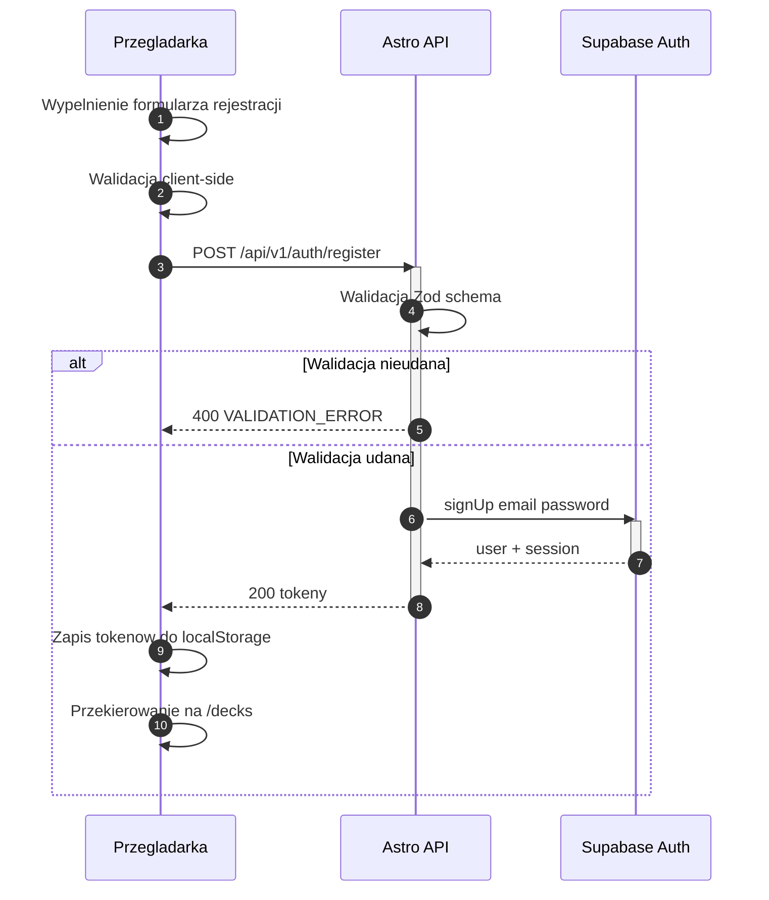
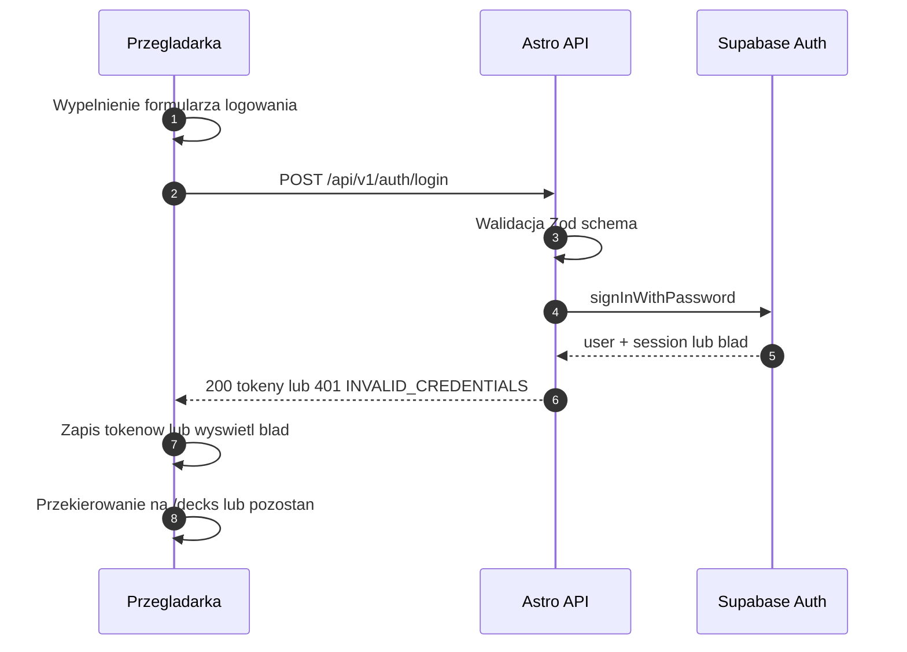
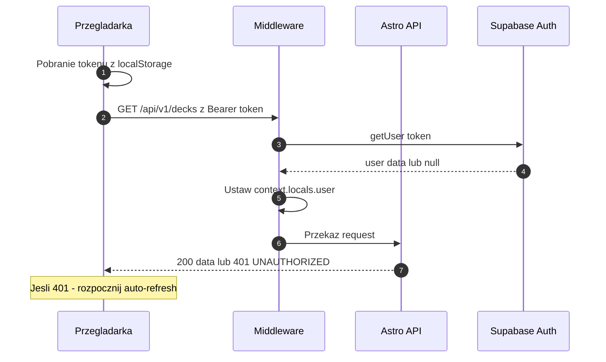
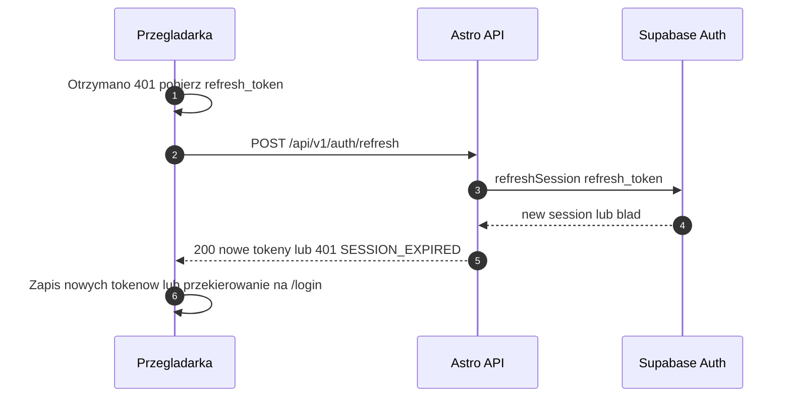
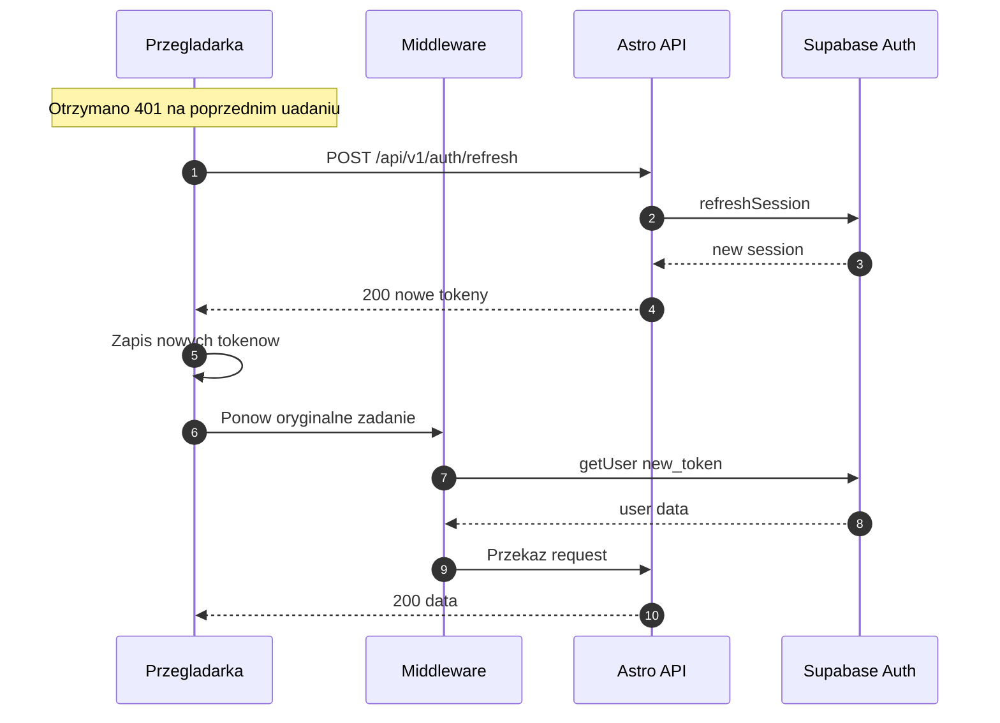
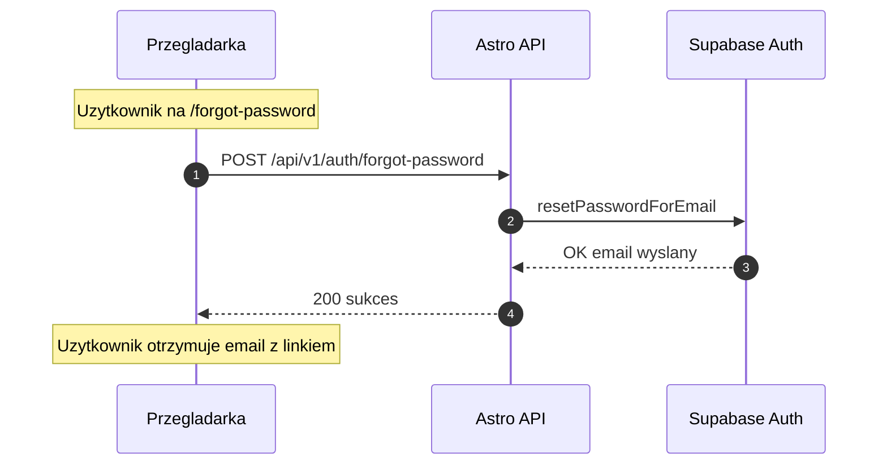
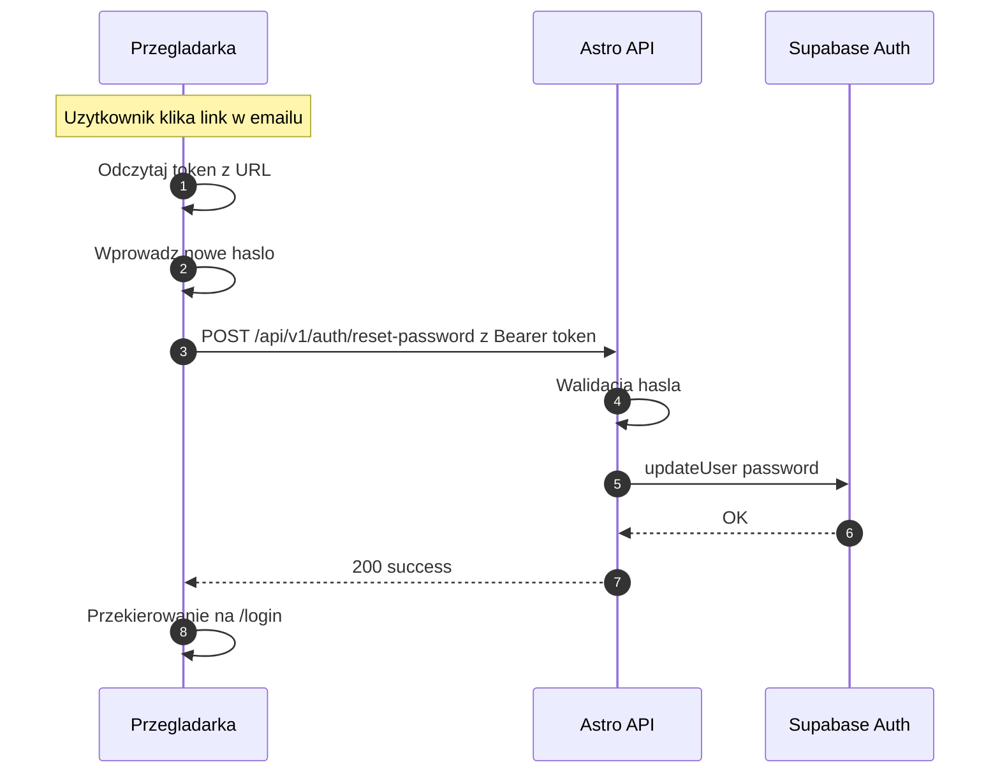
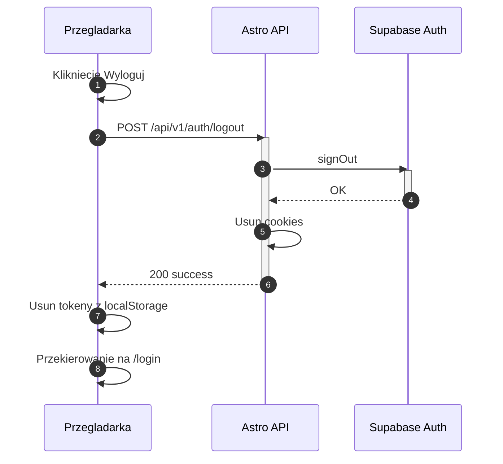
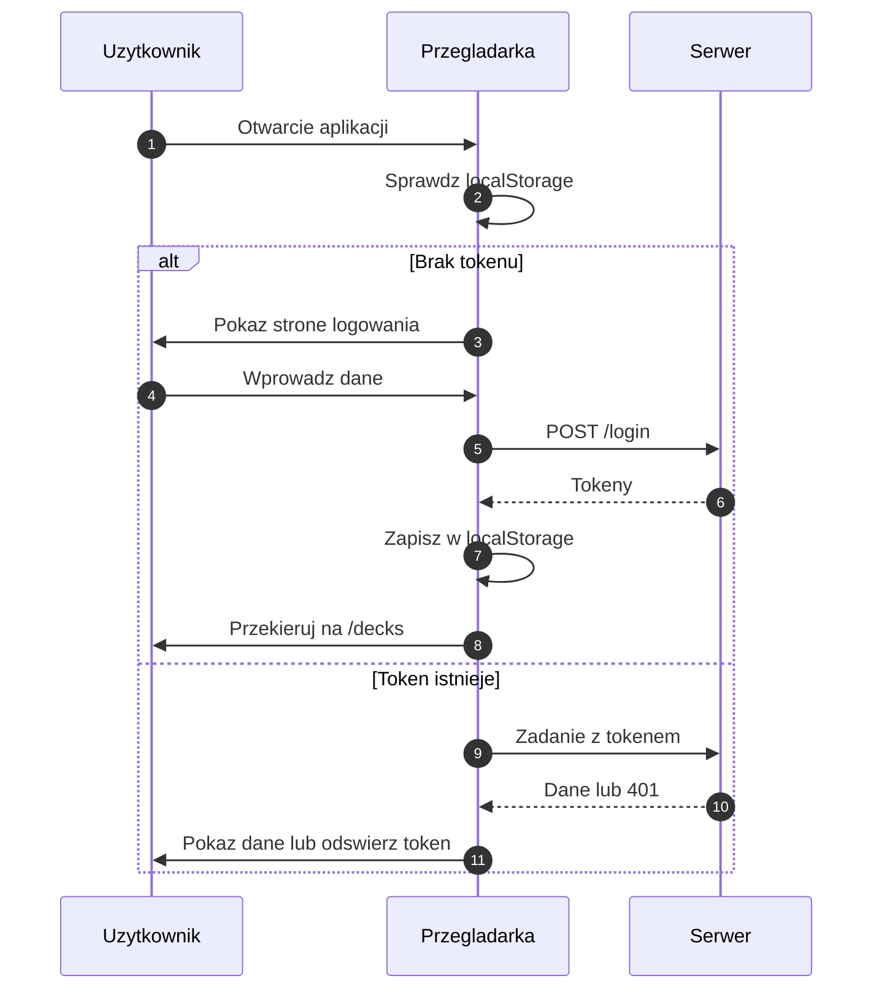

# Diagram przepływu autentykacji

Ten dokument przedstawia kompleksowy diagram sekwencji autentykacji dla modułu
logowania i rejestracji w aplikacji 10x-cards.

## Aktorzy

- **Przeglądarka** - Frontend React/Astro (formularze, localStorage)
- **Middleware** - Astro middleware weryfikujące tokeny
- **Astro API** - Endpointy API (`/api/v1/auth/*`)
- **Supabase Auth** - Zewnętrzny serwis autentykacji

## 1. Przepływ rejestracji

## 2. Przepływ logowania

## 3. Żądanie API z autoryzacją

## 4. Odświeżanie tokenu

## 4a. Odświeżanie tokenu - pełny przepływ z retry

## 5. Reset hasła - żądanie linku

## 5a. Reset hasła - ustawienie nowego hasła

## 6. Wylogowanie

## 7. Diagram ogólny - cykl życia sesji

## Podsumowanie mechanizmów

### Przechowywanie tokenów

- **localStorage.auth_token** - access token (JWT) do autoryzacji żądań API
- **localStorage.auth_refresh_token** - refresh token do odświeżania sesji

### Ochrona ścieżek

- **Ścieżki publiczne** (bez autoryzacji):
  - `/`, `/login`, `/register`, `/forgot-password`, `/reset-password`
  - `/api/v1/auth/*` (endpointy autentykacji)
- **Ścieżki chronione**:
  - `/api/v1/*` (wszystkie pozostałe endpointy API)

### Walidacja

- **Client-side**: podstawowa walidacja formularzy (email, hasło)
- **Server-side**: pełna walidacja Zod schemas

### Obsługa błędów

- `400 VALIDATION_ERROR` - błędy walidacji danych wejściowych
- `401 INVALID_CREDENTIALS` - niepoprawne dane logowania
- `401 UNAUTHORIZED` - brak lub nieważny token
- `401 SESSION_EXPIRED` - wygasła sesja
- `401 INVALID_TOKEN` - nieprawidłowy token resetu hasła
- `409 EMAIL_EXISTS` - email już zarejestrowany
