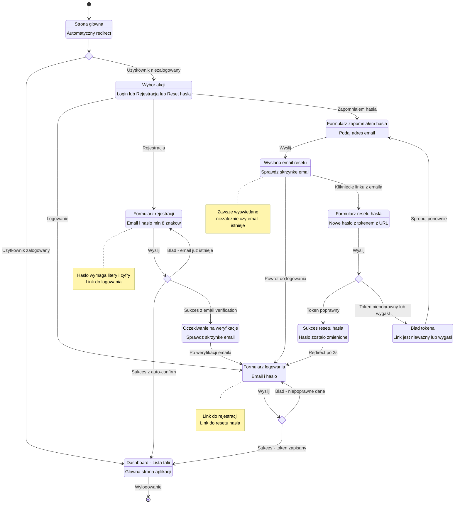
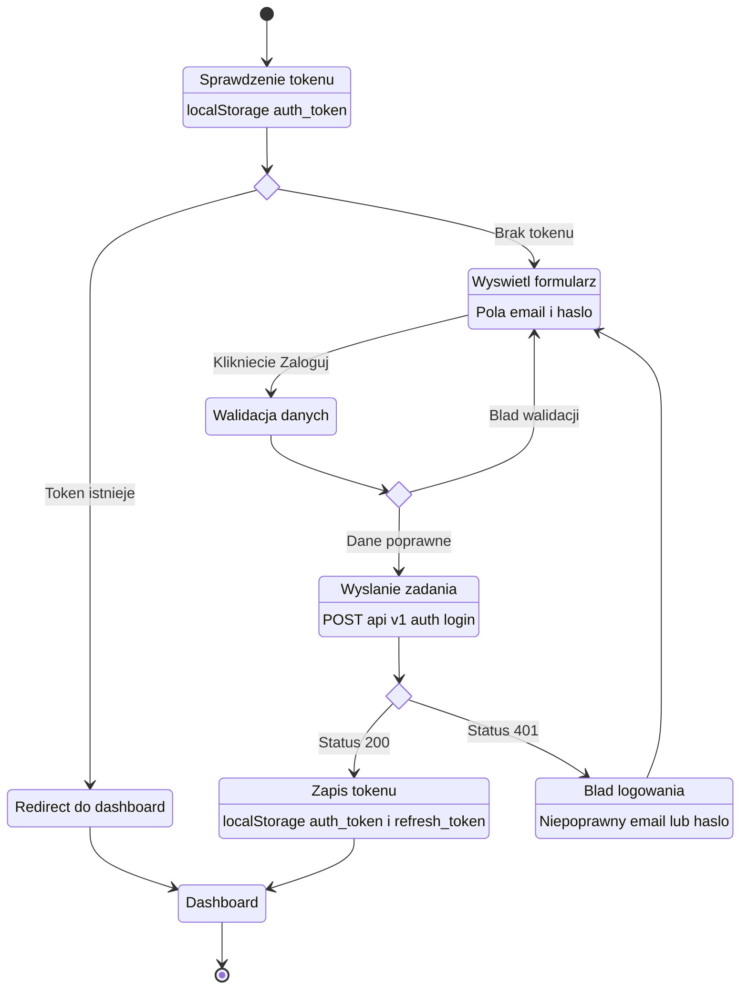
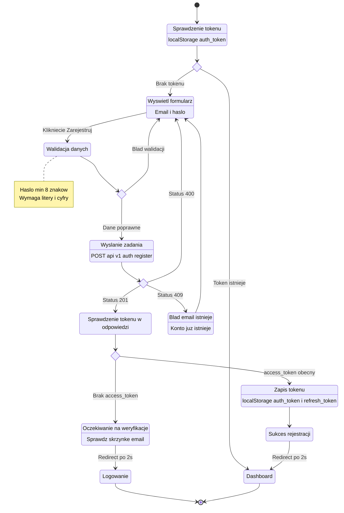
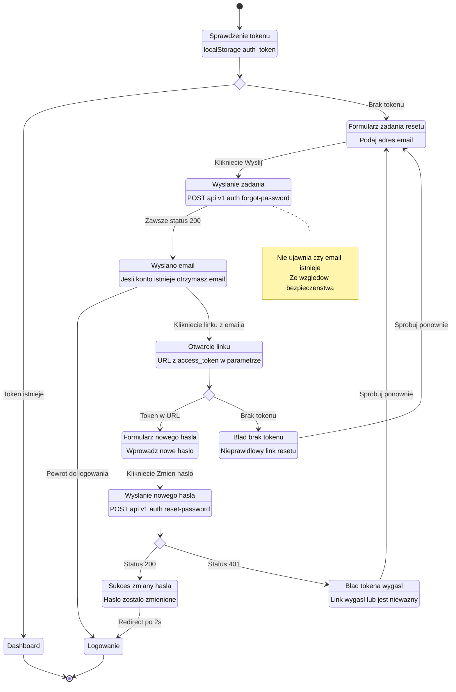
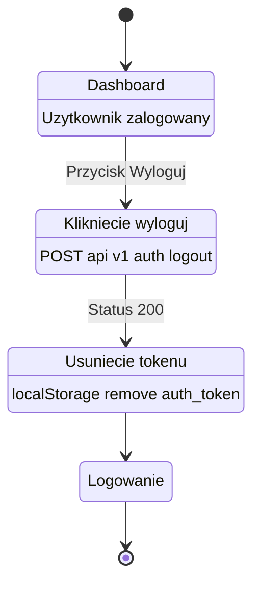

# Diagram podróży użytkownika - Moduł Logowania i Rejestracji

## Opis

Ten dokument zawiera diagramy podróży użytkownika dla modułu autentykacji aplikacji 10x-cards.
Diagramy zostały oparte na wymaganiach z PRD (US-001, US-002, US-003) oraz implementacji kodu.

## Główny diagram podróży użytkownika

## Diagram przepływu logowania

## Diagram przepływu rejestracji

## Diagram przepływu resetowania hasła

## Diagram wylogowania

## Legenda

| Element             | Znaczenie                   |
| ------------------- | --------------------------- |
| `[*]`               | Stan poczatkowy lub koncowy |
| `<<choice>>`        | Punkt decyzyjny             |
| Stan prostokatny    | Akcja lub widok             |
| Strzalka z etykieta | Przejscie z opisem warunku  |
| `note`              | Dodatkowa informacja        |

## Zrodla

- PRD: `.ai/prd.md` (US-001, US-002, US-003)
- Implementacja: `/src/pages/` (login, register, forgot-password, reset-password)
- Komponenty: `/src/components/auth/`
- API: `/src/pages/api/v1/auth/`
