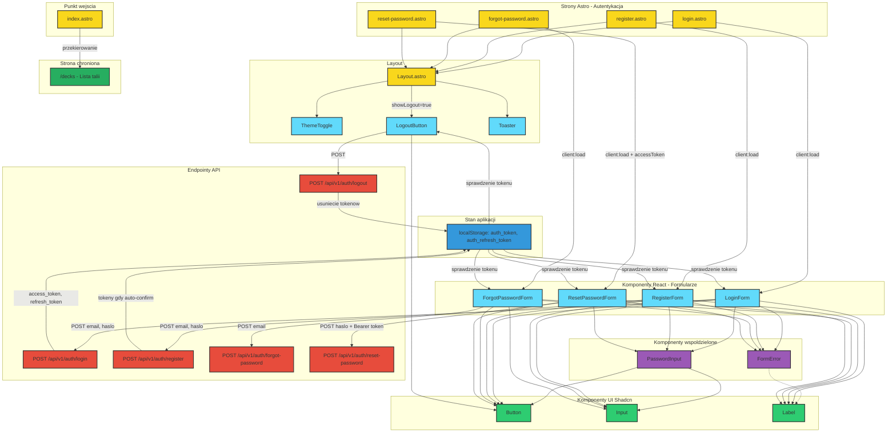
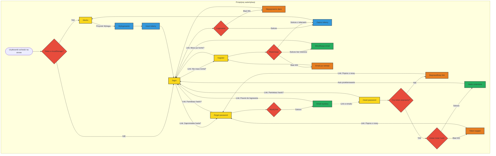
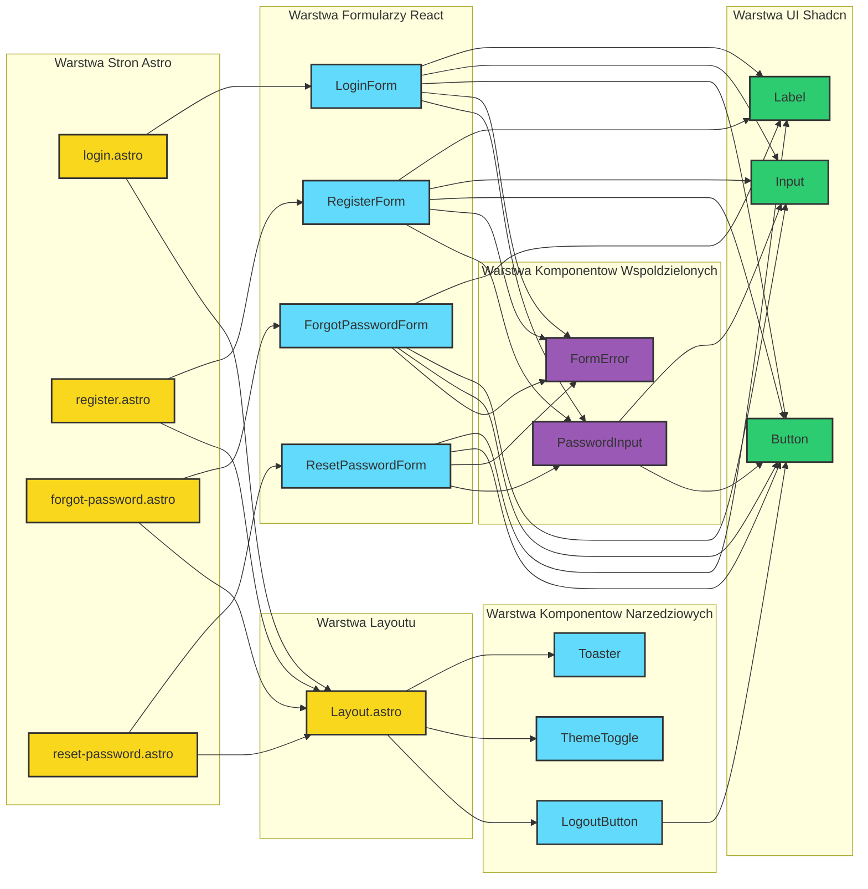

# Architektura UI - Moduł Logowania i Rejestracji

## Diagram architektury

<mermaid_diagram>

</mermaid_diagram>

---

## Diagram nawigacji i przeplywo uzytkownika

<mermaid_diagram>

</mermaid_diagram>

---

## Diagram zaleznosci komponentow

<mermaid_diagram>

</mermaid_diagram>

---

## Opis komponentow

### Strony Astro

| Strona | Sciezka | Opis | Props przekazywane |
|--------|---------|------|-------------------|
| login.astro | /login | Strona logowania | redirectTo z query param |
| register.astro | /register | Strona rejestracji | brak |
| forgot-password.astro | /forgot-password | Strona odzyskiwania hasla | brak |
| reset-password.astro | /reset-password | Strona ustawiania nowego hasla | accessToken z query param |

### Komponenty React - Formularze

| Komponent | Funkcjonalnosc | Walidacja | API Endpoint |
|-----------|----------------|-----------|--------------|
| LoginForm | Logowanie email i haslo | Email format, haslo wymagane | POST /api/v1/auth/login |
| RegisterForm | Rejestracja nowego konta | Email, haslo min 8 znakow z litera i cyfra, potwierdzenie | POST /api/v1/auth/register |
| ForgotPasswordForm | Wysylanie linku resetujacego | Email format | POST /api/v1/auth/forgot-password |
| ResetPasswordForm | Ustawienie nowego hasla | Haslo min 8 znakow z litera i cyfra, potwierdzenie | POST /api/v1/auth/reset-password |

### Komponenty wspoldzielone

| Komponent | Funkcjonalnosc |
|-----------|----------------|
| PasswordInput | Pole hasla z przyciskiem pokazywania i ukrywania wartosci |
| FormError | Wyswietlanie komunikatow bledow w formularzu |
| LogoutButton | Przycisk wylogowania, warunkowe renderowanie gdy zalogowany |
| ThemeToggle | Przelacznik motywu jasny i ciemny |

### Zarzadzanie stanem

- **localStorage** - przechowuje `auth_token` i `auth_refresh_token`
- Wszystkie formularze auth sprawdzaja token przy montowaniu i przekierowuja do /decks jesli uzytkownik jest zalogowany
- LogoutButton sprawdza token i renderuje sie tylko gdy uzytkownik jest zalogowany

### Linki nawigacyjne w formularzach

| Z formularza | Do strony | Tekst linku |
|--------------|-----------|-------------|
| LoginForm | /register | Nie masz konta? Zarejestruj sie |
| LoginForm | /forgot-password | Zapomniales hasla? |
| RegisterForm | /login | Masz juz konto? Zaloguj sie |
| ForgotPasswordForm | /login | Pamietasz haslo? Zaloguj sie |
| ForgotPasswordForm sukces | /login | Powrot do logowania |
| ResetPasswordForm | /login | Pamietasz haslo? Zaloguj sie |
| ResetPasswordForm blad | /forgot-password | Popros o nowy link |
